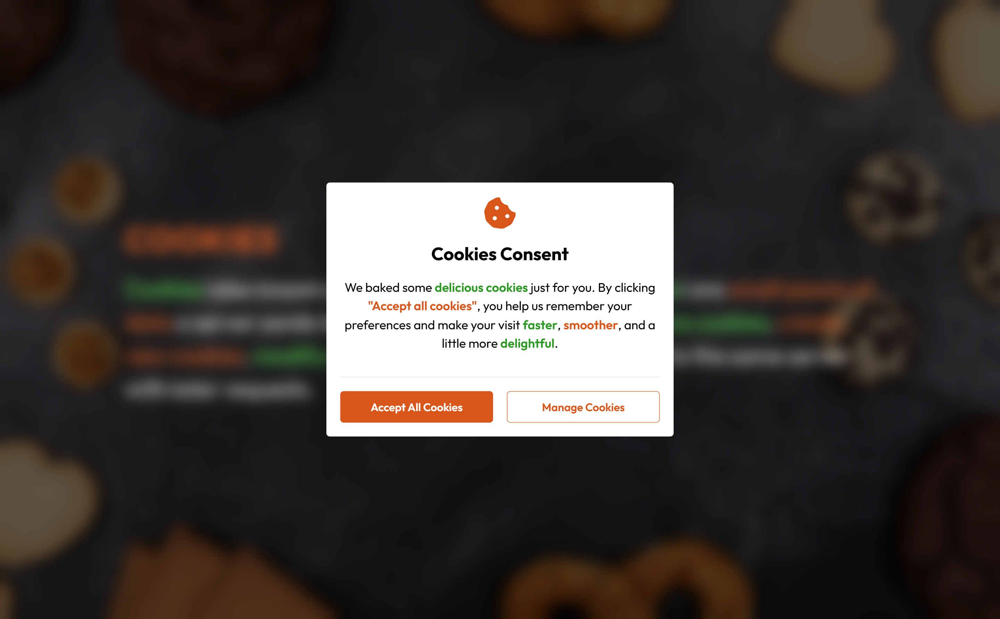

# Cookies



## Description

**Cookies** is a modern cookie-preferences interface that allows users to control what device information they share. The application demonstrates how cookies can be created, managed, and stored using JavaScript while providing a clean, accessible, and responsive user experience.

This project focuses on practical cookie handling, dialog interactions, and user preference management using modern front-end development practices.

## Features

- Cookie consent dialog
- Cookie preference management dialog
- Accept all cookies functionality
- Reject all cookies functionality
- Individual preference toggles
- Cookie expiration handling
- Responsive UI design
- Accessible toggle switches

## Cookie Data Collected

Users can choose whether to allow storage of:

- Browser Name
- Operating System
- Screen Height
- Screen Width

Each option can be enabled or disabled individually.

## Technologies Used

### Front-End

- HTML5
- CSS3
- JavaScript (Vanilla)

### Tools Used

- VS Code
- Git
- GitHub

## Key Implementation Details

### Store Cookies

Function to accept all cookies and store them on the browser:

```js
function acceptAllCookies() {
  checkBoxes.forEach((checkbox) => {
    checkbox.checked = true;
  });

  const [browserName, osName, screenHeight, screenWidth] = getDeviceInfo();

  const settingsValues = {
    Browser: browserName,
    "Operating System": osName,
    "Screen Height": screenHeight,
    "Screen Width": screenWidth
  };

  for (const setting in settingsValues) {
    setCookie(setting, settingsValues[setting], COOKIE_MAX_AGE);
  }

  if (cookieDialog.open) cookieDialog.close();

  setTimeout(() => {
    if (settingsDialog.open) settingsDialog.close();
  }, 1000);
}
```

### Save Cookies Preference

Cookies are saved based on what the user selects/deselects:

```js
function savePreferences(e) {
  const data = new FormData(e.target);
  const entries = Object.fromEntries(data.entries());
  const { browser, os, height, width } = entries;

  const [browserName, osName, screenHeight, screenWidth] = getDeviceInfo();

  browser ? setCookie("Browser", browserName, COOKIE_MAX_AGE) : setRejectedCookie("Browser");

  os ? setCookie("Operating System", osName, COOKIE_MAX_AGE) : setRejectedCookie("Operating System");

  height ? setCookie("Screen Height", screenHeight, COOKIE_MAX_AGE) : setRejectedCookie("Screen Height");

  width ? setCookie("Screen Width", screenWidth, COOKIE_MAX_AGE) : setRejectedCookie("Screen Width");

  if (settingsDialog.open) settingsDialog.close();
}
```

## Demo

Click [here]() to demo
